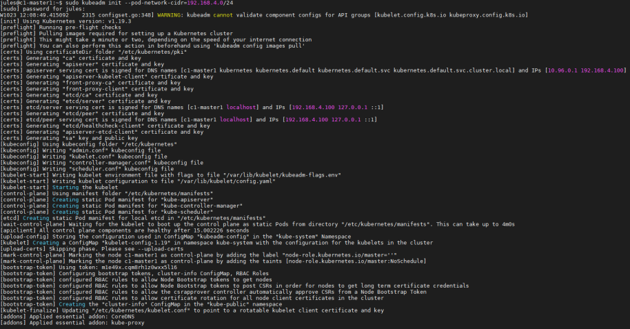
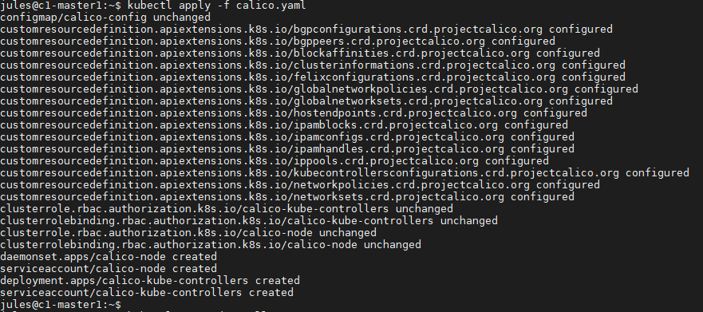

### Dot this only on Master VM

## Installation d'un master Kubernetes

Téléchager le fichier calico.yaml
```bash
wget https://docs.projectcalico.org/manifests/calico.yaml
```

Modifier le fichier en fonction de la plage pool de votre réseau
```bash
sudo nano calico.yaml
```

Décommenter la ligne "name: CALICO_IPV4POOL_CIDR" est mettre la bonne valeur dans "value" en fonction du réseau.
```yaml
...
# The default IPv4 pool to create on startup if none exists. Pod IPs will be chosen from this range. Changing this value after installation will have no effect. This should fall within --cluster-cidr.
- name: CALICO_IPV4POOL_CIDR
  value: "192.168.4.0/24"
...
```

Création du cluster Kubernetes
```bash
sudo kubeadm init --pod-network-cidr=192.168.4.0/24
```

La procédure peut prendre quelques temps


Une fois la procédure finie.

Kubernetes donne une liste de commande à exécuter.

Ainsi que la commande à utiliser sur chaque Node pour les lier avec le Master


Ont éxécuter donc les commandes suivantes:
```bash
mkdir -p $HOME/.kube
sudo cp -i /etc/kubernetes/admin.conf $HOME/.kube/config
sudo chown $(id -u):$(id -g) $HOME/.kube/config
```
Cela permet à l'utilisateur actuellement connecté d'avoir accès à kubectl sur le master1 et à authentfier l'utilisateur sur l'API Server pour éxécuter des tâches d'administration


## Configuration d'un master Kubernetes

Il faut appliquer la configuration du fichier calico.yaml, se qui va déployer et ajouter la configuration de sécurité sur le "Pod Network"
```bash
kubectl apply -f calico.yaml
```

Cela créer des fichiers de configuration de sécurité des ressources nécessaires à la création du "Pod Network"



__En cas d'erreur vérifier la bonne indentation du fichier calico.yaml__

### Quelques commandes concernant Kubectl

Lister tous les pods du cluster, à cette étape ils doivent tous être en "Running"
```
kubectl get pods --all-namespaces
```

Affiche en permanence l'état des pods, sans devoir rafraichir l'écran
```
kubectl get pods --all-namespaces --watch
```

Liste toutes les nodes courrantes, à cette étape seul le master apparait
```
kubectl get nodes
```


### Vérification du service

Comparont l'état du service
```bash
sudo systemctl status kubelet.service
```


Maintenant le service est UP et sans erreur.

## Emplacement des fichiers de configuration

La liste des fichiers de configuration ce trouve ici
```bash
ls /etc/kubernetes
```


Ont retrouve:
* Les fichiers de configuration
* Le dossier manifests contenant les manifests pods
* Le dossier pki contenant "certificate authority"

En regardant en détail le dossier /etc/kubernetes/manifests, ont peux voir tous les pods de chaque composant formant la Node Master (API Server, Controller Manager, Scheduler).
Le kubelet monitor ce dossier à partir de ces fichiers et permet de maintenir le cluster disponible.

## Retrouver le token
Si vous avez perdu le token pour ajouter une nouvelle node
```
kubeadm token list
```

Si vous voulez genérer un autre token, en cas d'oublis de d'expiration 
```
kubeadm token create
```

Vous pouvez également trouver le hash du certificate CA
```
openssl x509 -pubkey -in /etc/kubernetes/pki/ca.crt | openssl rsa -pubin -outform der 2>/dev/null | openssl dgst -sha256 -hex | sed 's/^.* //'
```