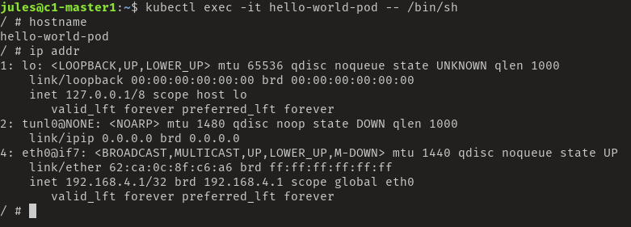
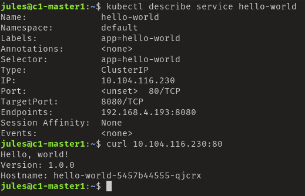

## Imperative configuration
La configuration imperative, s'execute une ligne de commande après l'autre.
Créant ainsi un objet après l'autre.

```bash
kubectl create deployment nginx --image=nginx
```
La commande passe par "l'API Server", un objet est crée. Mais en ligne de commande seul un ibjet à la fois peut être utilisé.
```bash
kubectl run nginx --image=nginx
```
Cela créer un pod en utilisant nginx.

Cela permet de gérer le cluster, mais devient difficile si l'architecture ou l'applications se complexifie.

### Example Côté Master
Creation d'un déploiement nommé "hello-world", le conteneur est simplement un serveur web affichant "Hello World"
```bash
kubectl create deployment hello-world --image=gcr.io/google-samples/hello-app:1.0
```


Il est temps de déployer un pod
```bash
kubectl run hello-world-pod --image=gcr.io/google-samples/hello-app:1.0
```
Et de regarder le résultat
```bash
kubectl get pod
```
Ici nous avons bien nos 2 pods déployé


```bash
kubectl get deployment
kubectl get pods -o wide
```


### Example Côté Node
Il est intéressant de voir comment les conteneurs ont été généré dans les nodes

```
bash
ssh jules@c1-node1
sudo docker ps
```


### Regarder les logs
Il est intéressant de regarder les logs provenant de cette manipulation

```bash
kubectl log hello-world-pod
```


### Exec in a container
Il est possible comme avec Docker de se connecter à un conteneur

```bash
kubectl exec -it hello-world-pod -- /bin/sh
```



### Détail du déploiement
Ces commandes permettent de regarder l'état actuel du déploiement
```bash
kubectl get deployments.apps hello-world
kubectl get replicasets.apps
kubectl get pods
```

Tous est UP et dans le "desired state"

```bash
# Take a closer look at our application using: describe
kubectl describe deployments.apps hello-world
kubectl describe pods hello-world-5457b44555-qjcrx
#But the service is not expose, let's do it
kubectl expose deployment hello-world --port=80 --target-port=8080
```
Maintenant que le service est exposé, il est possible de regarder le résultat
```bash
kubectl get service hello-world
```


```bash
#More precise information about the service
kubectl describe service hello-world
#Test the container
curl http://10.104.116.230:80
```



```bash
#List all the endpoint of a service
kubectl get endpoints hello-world
```
En faisant la requête curl sur l'IP et le port de la commande "get endpoints", nous outrepassons le service de load balancer en accédant au pod directement. Pratique pour le débug, mais pas pour la prod.

## Declarative configuration
### Nous définissons l'état désiré dans le code
A travers des manifest, nous pouvons d'écrire l'état dans lequel nous voulons que l'architecture soit maintenue.

Ces manifest peuvent être écrit en JSON ou YAML et être donné à "l'API Server" via
```bash
kubectl apply -f deployment.yaml
```

Nous récupérons la configuration de notre service précédemment installé.
```bash
#Using kubectl to generate yaml or json files of our imperitive configuration.
kubectl get service hello-world -o yaml
kubectl get service hello-world -o json
```

__WARNING: "--export is deprecated" nous verrons plus loin comment générer de nouveaux ces fichiers__
```bash
#Save theses info for a redeployment
kubectl get service hello-world -o yaml --export > service-hello-world.yaml
kubectl get deployment hello-world -o yaml --export > deployment-hello-world.yaml
```

```bash
#We can ask the API for more information about an object
kubectl explain service | more

#And drill down further if needed, includes very good explanation of what's available for that resource
kubectl explain service.spec | more
kubectl explain service.spec.ports
kubectl explain service.spec.ports.targetPort
```

Supprimons les instances créer précédemment
```bash
kubectl delete service hello-world
kubectl delete deployment hello-world
kubectl delete pod hello-world-pod
kubectl get all
```


Création du déploiement

```bash
#Deploying applications declarativly and store in the file (this command DON'T lauch the deployment)
kubectl create deployment hello-world \
     --image=gcr.io/google-samples/hello-app:1.0 \
     --dry-run=client -o yaml > deployment-hello-world.yaml

cat deployment-hello-world.yaml
#Apply deployment from the file created above
kubectl apply -f deployment-hello-world.yaml
```

Idem pour le service

```bash
#Expose the service from the deployment
kubectl expose deployment hello-world \
     --port=80 --target-port=8080 \
     --dry-run=client -o yaml > service-hello-world.yaml 

cat service-hello-world.yaml 
#If the file already exists
kubectl apply -f service-hello-world.yaml 
```

Grace à ce système de fichier, il est possible de changer directement la configuration d'un déploiement
```bash
#scale up our deployment
nano deployment-hello-world.yaml
Change replicas from 1 to 2
     replicas: 2
#Apply the changes
kubectl apply -f deployment-hello-world.yaml
#Check it
kubectl get deployment hello-world
```


Il est alors possible de tester le load balancer en répétant la requête curl
```bash
#Repeat the curl access to see the load balancing of the HTTP request
kubectl get service hello-world
curl http://$SERVICEIP:80
```

Il est également possible modifier "on the fly" la configuration

```bash
kubectl edit deployment hello-world

#The deployment is scaled to 3 and we have three pods
kubectl get deployment hello-world
kubectl get pods 

#Let's clean up our deployment and remove everything
kubectl delete deployment hello-world
kubectl delete service hello-world

kubectl get all
```